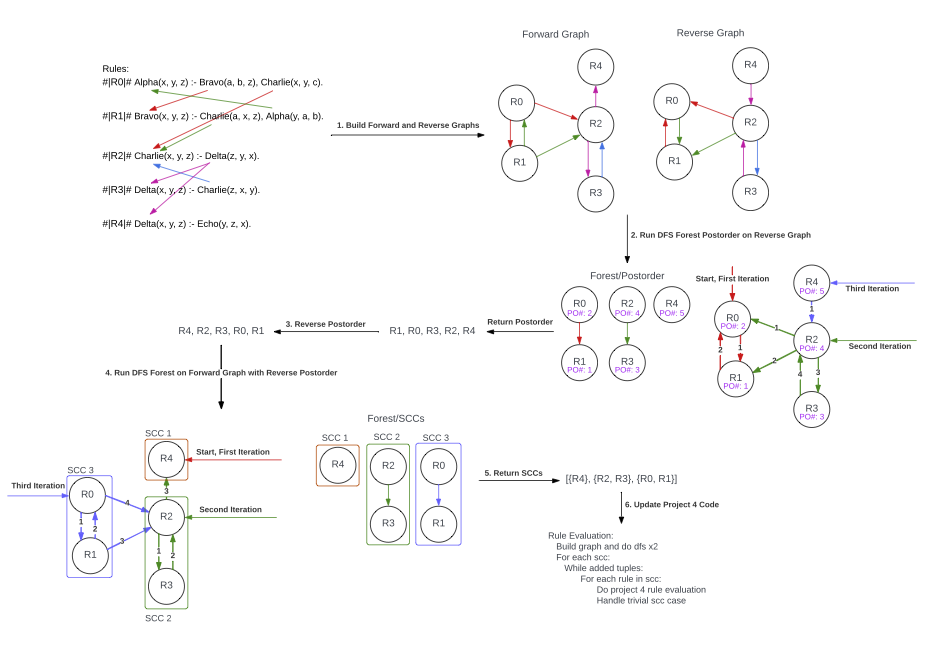

# Discrete Datalog Interpreter

## Optimized Rule Evaulation Overview and Major Steps

0. **Build the forward and reverse graphs**: detailed in [OPT_RULES_INTERP.md](./docs/OPT_RULES_INTERP.md) and foundational to the optimized rule evaluation. The graph captures the dependency between rules that update relations and rules tha consume those update relations.
0. **Run DFS Forest Post-order on Reverse Graph**: this step captures where any SCC starts in the graph and produces an order that if followed, guarantees that a simple DFS can be used to generate each SCC in the graph. Construct the post-order, stored as a vector, as you perform the DFS traversal.
0. **Reverse Post-order**: here is the key observation for generating each SCC: taking the post-order numbers from the reverse graph, and then reversing that sequence, means that the next step will discover SCCs from the leafs up.
0. **Run DFS on the Forward Graph with Reverse PostOrder**: this step generates the actual SCCs in the graph.
0. **Return SCCs**: these are the inputs for optimized rule evaluation. The rules in each SCC are evaluated to a fix-point. So in the order the SCCs are generated, evaluate the rules in the current SCC to a fix-point, and then move to the next SCC.